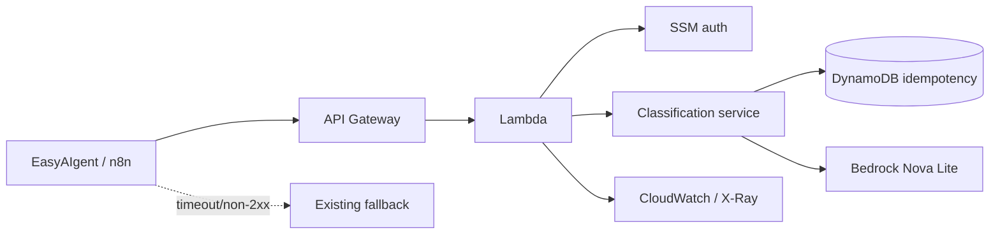

# AWS Bedrock Production Integration

A sanitized, reproducible version of a **real EasyAIgent integration that was deployed and validated on AWS**: API Gateway → Lambda → Amazon Bedrock Nova Lite, with DynamoDB idempotency, SSM-backed authorization, CloudWatch/X-Ray observability, and a production fallback boundary.

The public repo contains no account IDs, credentials, customer data, production endpoints, or proprietary workflow code.

## 20-second review

| Question | Evidence |
|---|---|
| **Problem** | Add a major-cloud AI path without making a model call a new single point of failure. |
| **Architecture** | HTTP API → Lambda → typed service → DynamoDB authority + Bedrock; SSM auth; CloudWatch/X-Ray. |
| **Key decision** | Idempotency and authorization are deterministic software boundaries, not LLM responsibilities. |
| **Failure modes** | Duplicate request, malformed model output, auth failure, model timeout, cloud unavailability. |
| **Evidence** | Executable unit tests, 90%+ coverage gate, strict type checks on core, SAM IaC, smoke test for 401/200/cache replay. |

## What was validated in the real integration

The EasyAIgent deployment used **Nova Lite through Lambda/API Gateway**, DynamoDB durable request state/idempotency, CloudWatch observability, scoped IAM + encrypted SSM authentication, real n8n traffic, an unauthorized `401` boundary, authorized `200` inference, and verified retry/safe-fallback behavior.

This repository is the sanitized engineering counterpart; it is intentionally not a dump of production code or data.

## Architecture



See [`docs/ARCHITECTURE.md`](docs/ARCHITECTURE.md), [`docs/THREAT_MODEL.md`](docs/THREAT_MODEL.md), and [`docs/RUNBOOK.md`](docs/RUNBOOK.md).

## Local verification

```bash
python -m venv .venv
# activate the environment
python -m pip install -e ".[dev]"
make verify
```

The deterministic test suite requires no AWS or LLM credentials.

## Infrastructure verification

```bash
sam validate --lint
sam build
```

Deployment expects an encrypted SSM parameter (default name `/easyaigent/bedrock-classifier/api-key`). The template grants the Lambda function access to the selected Bedrock model, its DynamoDB table, the named SSM parameter, and X-Ray writes.

After deployment:

```powershell
.\scripts\smoke_test.ps1 -ApiUrl '<ApiUrl>' -ApiKey '<secret from your secure source>'
```

The smoke sequence proves three boundaries: unauthenticated request → `401`; authenticated request → `200`; exact replay → `cached=true` without a second model inference.

## Repository map

```text
src/
  models.py        typed request / model-output contracts
  ports.py         store and model interfaces
  service.py       deterministic orchestration + idempotency
  http_adapter.py  auth, validation and HTTP mapping
  aws_adapters.py  Bedrock, DynamoDB and SSM adapters
  app.py           thin Lambda composition root

tests/             credential-free deterministic tests
docs/              architecture, threat model, runbook, ADRs
template.yaml       AWS SAM / CloudFormation
```

## Engineering principles

**business invariant → deterministic authority → typed AI boundary → bounded failure → observable operation**

The LLM may classify ambiguous text. It does not own authentication, idempotency, persistence, or downstream side effects.

---

**Mauricio Alfonso Cano** · AI Systems & Agent Engineer · Guadalajara, Mexico
[GitHub](https://github.com/mauricio-cano-ai) · [LinkedIn](https://www.linkedin.com/in/mauricio-alfonso-cano-ai/)
