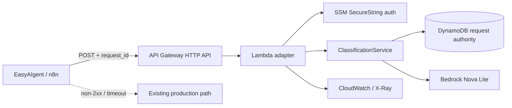

# Architecture

## Deterministic authority
The model never owns idempotency or side effects. A stable `request_id` is claimed in DynamoDB before Bedrock invocation. A completed request returns the persisted typed result without another model call. A concurrent duplicate receives a conflict instead of producing duplicate spend or ambiguous state.

## Typed model boundary
Bedrock output is parsed as JSON and validated against `LeadClassification`. Unexpected prose or an invalid enum fails closed rather than being silently accepted.

## Failure containment
The public implementation releases a failed claim so a bounded upstream retry can re-attempt. In EasyAIgent the AWS path was introduced as a shadow/low-risk classifier with an existing fallback path, so the integration did not become a new single point of failure.
